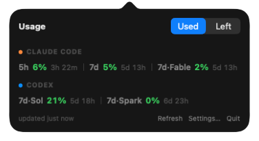

# cc-meter

A native macOS menu bar app that shows your Claude Code and OpenAI Codex usage
limits in real time.

  

Click the menu bar item and every limit you have is there, one line per provider.
Each cell is a quota window (`5h`, `7d`, or a per-model one like `7d·Sol`), how
much of it you have used, and how long until it resets.

The percentage *is* the meter: green under 50%, amber from 50%, red from 90%. So
you read the panel at a glance rather than parsing it — nothing shouts while
you are fine.

When a limit does go critical, an alert line appears above the list naming the
one that will run out first, and it disappears again once the limit clears. It
is the only thing that ever changes the panel's shape, which is what makes it
worth noticing.

cc-meter automatically detects signed-in providers. For Claude Code it reads the
OAuth token stored by the `claude` CLI in your macOS Keychain. For Codex it uses
Codex's local app-server protocol, leaving credential access and token refresh to
Codex itself. No token is ever displayed or stored by cc-meter.

## Install with Homebrew

    brew install raheelkazi/tap/cc-meter
    brew services start cc-meter

That builds cc-meter, installs it, and runs it as a menu bar app that starts at
login. The first time it reads your usage, macOS asks to allow `security` to
access your Keychain - click "Always Allow" once and it will not ask again.

Manage it with:

    brew services restart cc-meter   # after an upgrade
    brew services stop cc-meter      # stop and disable

## Automatic updates

Automatic updates arrive with v0.4.3. Existing installations need one manual
bootstrap upgrade before the app can update itself:

    brew update
    brew upgrade cc-meter

Starting with v0.4.3, cc-meter checks once per day by default and upgrades only
the `raheelkazi/tap/cc-meter` formula when a new version is available. You can
turn this off with **Settings… > Automatically install cc-meter updates**.

Automatic updates run only when cc-meter was launched as the
`homebrew.mxcl.cc-meter` Homebrew service. Development runs such as
`swift run cc-meter` never invoke Homebrew. If an update fails, diagnostics are
written to `~/Library/Logs/cc-meter/update.log`. To recover manually, run:

    brew upgrade cc-meter

## Requirements

- macOS 13 or later
- The `claude` CLI, signed in, for Claude Code usage
- The Codex app or `codex` CLI, signed in, for Codex usage
- At least one of those providers installed and signed in
- Swift toolchain (Xcode or the Swift command line tools)

## Run

    swift run cc-meter

The app runs as a menu bar accessory (no dock icon). Click the menu bar item for
the full breakdown. Each provider's limits appear on their own line when both are
available. The menu-bar percentage comes from the most constrained visible
provider. Use the Used/Left control to switch both providers between used and
remaining views, Refresh to fetch both immediately, Settings… to open
preferences, and Quit to exit.

Usage refreshes every minute by default (configurable in Settings).

## Features

- **Dual-provider live meter** for Claude Code and Codex quota windows, including
  named or model-specific limits, color-coded green/amber/red with a reset
  countdown.
- **Automatic detection and isolation**: Codex stays hidden when it is absent or
  signed out, and one provider's failure never blanks valid data from the other.
- **Threshold notifications**: get a macOS notification when a limit crosses
  80% / 95% / 100% (configurable), plus an optional heads-up before the 5-hour
  window resets. Alerts are edge-triggered, so you get one per crossing and they
  re-arm after each window reset.
- **Burn-rate projection**: when a limit is on pace to run out before it resets,
  the panel says so. It stays quiet otherwise.
- **Spend / extra-credits row**: rendered when the usage endpoint reports it.
- **Automatic token refresh**: on an expired token the app silently refreshes
  using the stored refresh token and retries, falling back to a re-authenticate
  message only if refresh isn't possible.
- **Preferences window**: poll interval, notification thresholds, default
  used/remaining view, history on/off, automatic updates, and launch-at-login.

## How it works

- Claude token: macOS Keychain, generic password, service
  `Claude Code-credentials`.
- Claude endpoint: `GET https://api.anthropic.com/api/oauth/usage`.
- On an expired token the app attempts a silent OAuth refresh and writes the new
  token back to the Keychain. If refresh isn't possible it shows a
  re-authenticate message; run `claude` and the meter recovers on the next poll.
- Codex usage: a short-lived `codex app-server --stdio` process and the stable
  `account/rateLimits/read` RPC. Codex owns credential storage, account selection,
  and token refresh; cc-meter never reads or stores Codex OAuth tokens.
- Provider caches and history are stored separately under
  `~/Library/Application Support/cc-meter/`, bounded to the last 7 days.
  Preferences are stored in `UserDefaults`.
- Launch-at-login installs a per-user LaunchAgent
  (`~/Library/LaunchAgents/com.raheelkazi.cc-meter.plist`).
- Notifications are delivered via `osascript` (macOS may ask you to allow
  notifications for Script Editor the first time).

## Development

    swift test     # run the unit tests (core logic)
    swift build    # build
    swift run cc-meter

The core logic (preferences, provider identity, Keychain parse/write, token
refresh, HTTP and Codex app-server clients, decoding, usage color, burn-rate,
history, notification rules, and dashboard models) lives in the `CCMeterCore`
library and is unit-tested with injected fakes. The `cc-meter` executable is thin
AppKit/SwiftUI glue plus platform adapters for Keychain, Codex subprocesses,
launchctl, and osascript.
